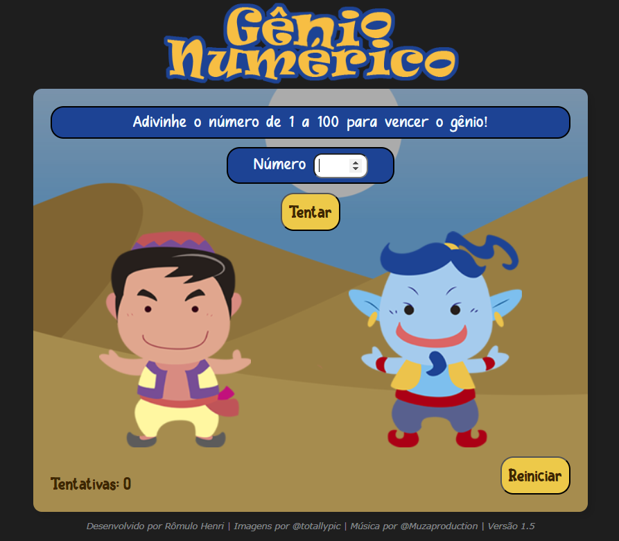

# Gênio Numérico

<!---Esses são exemplos. Veja https://shields.io para outras pessoas ou para personalizar este conjunto de escudos. Você pode querer incluir dependências, status do projeto e informações de licença aqui--->

<!--  -->
<!-- 

 -->

> Jogo de navegador baseado em desafios matemáticos.

### Linguagens e Tecnologias

  

<!--  -->

<!--  -->

<!--   

   -->

### Ajustes e melhorias

O projeto ainda está em desenvolvimento e as próximas atualizações serão voltadas nas seguintes tarefas:

-   [x] Reações básicas dos personagens.
-   [x] Sistema de record.
-   [x] Música de Fundo.
-   [ ] Menu.
-   [ ] Ranking.
-   [ ] Configurações
-   [ ] Animações.

### Versões

#### Versão 1.0

Versão inicial, número secreto entre 1 e 1.000. (HTML, CSS, JS)

#### Versão 1.1

Versão aprimorada, incrementado sistema de contagem de tentativas para quantificar o desempenho dos jogadores. (HTML, CSS, JS)

#### Versão 1.2

Versão responsiva, programado para ser mobile-friendly. (CSS)

#### Versão 1.3

Resolução de pequenos problemas, tela de vitória e organização dos arquivos como README.md (JS)

#### Versão 1.4

Aprimoramento, adicionado o recurso de "record" que salva o melhor desempenho no localStorage.

#### Versão 1.5

Adaptação do código para uso de SASS, Organização da Arquitetura do Projeto e Música de Fundo.
